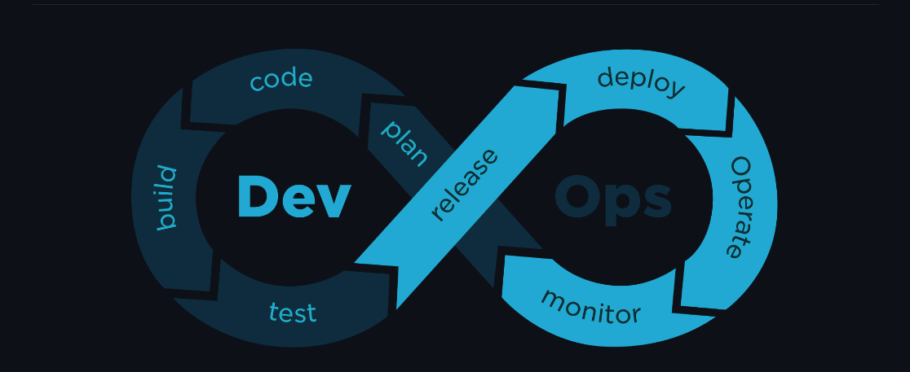

## What is DevOps?

DevOps is a software development methodology to create better, efficient and more secure applications, products and softwares in lesser time keeping the feedback of stakeholders and the state of the current market in mind which helps in gaining a competitive advantage for businesses and their customers.

It revolves around automation, collaboration , fast feedback, and iterative improvement at all the stages of the software development lifecycle.

DevOps is made up of two words :- "Development" and "Operations" which incorporates the two teams to work together and focus on planning,building,and testing a product along with deploying, operating and monitoring to percept any inconsistencies or flaws which could be intercepted in the shortest possible time frame.

## Benefits Of DevOps

- Speed
- Improved Collaboration
- Quality and Reliability
- Security
- Real-time Feedback
- Efficient
- Operate and Manage Infrastructure and Development Processes at Scale
- Adapt To Market Needs
- Improve Mean Time To Recovery

## Core DevOps Principles

- Automation Of The Software Development Life Cycle
- Collaboration and Communication
- Continuous Improvement and Minimization Of Waste
- Hyperfocus On User Needs With Short Feedback Loops

## DevOps Culture

Transitioning to DevOps requires a change in culture and mindset. Teams work together to optimize both the productivity of developers and the reliability of operations.

It is essential to take feedback , be accountable , communicate often , remove barriers , focus on quality, and take on different responsibilities in order to adopt a DevOps Mindset.

It is also important to look at the customer needs and improve upon it.

The best way to accomplish a DevOps culture is to break down traditional silos and reorganize them into cross-functional, autonomous DevOps teams that can work on code projects completely without waiting for any approvals from the other teams.

Having shorter release cycles and continuous learning can also be attributed to the DevOps Culture.

## DevOps Best Practices

- Perform Very Frequent But Small Updates
- Using Microservices Architecture To Make Their Applications More Flexible And Enable Quicker Innovation
- Infrastructure automation, Monitoring, and Logging Practices
- Situational Awareness
- Continuous Integration and Continuous Deployments
- Version Control

## Monolithic and Microservices Architecture

## Agile and Waterfall Approach/Method

## Scrum and Kanban Frameworks : Agile Approach

## DevSecOps

## Shifting Left

## DevOps Lifecycle

## Cloud-Native Approach
