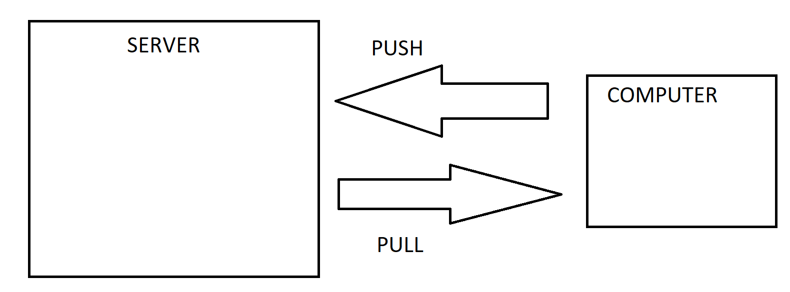

# Git and Github

## What is Git?

Git is a Version Control System which helps us in tracking files, storing changes, retrieving files, performing rollbacks, maintaining history of the project and collaborating with other folks of the Open Source community. Git was written in C.

## What is a Version Control System?

Version Control Systems also known as VCS also help us in tracking files, recovering files, figuring out who introduced the issue, when the issue was introduced, rollback to previous working state and collaborate with other people in the Open Source Community

## What is Github / Gitlab / BitBucket?

It is a hosting service which hosts our git repositories on the internet so that other people could make changes to the project source code in the form of Pull Requests and also point out new Issues in the code as well. Along with that, having public git repositories hosted on such sites helps in getting feedback from Customers and other members of the Open Source Community which lead to improvements over a period of time.

## What are the different types of VCS? What is the history of VCS?

- Local Version Control System
    -
    - Instead of manually keeping track of the changes , it is better if a program does that for us instead.
    - A Local VCS consists of a database which is used to keep track of all the changes to the files and folders
    - Drawback : As all the changes are stored on a local system, there is a chance of data loss if the hardware get's damage
    -   

- Centralized Version Control System
    -
    - Instead of sending .zip files to collaborate on a project, we can maintain a common server which hosts a common repository which many people can access.
    - People can pull the code , update the code and push the changes back to the server where the remote repository is located
    - As most people would have some version of the codebase, it would be some what recoverable if the server get's damaged, but we may not be able to recover the codebase as a whole.
    -  
    
- Distributed Version Control System
    -
    - A Distributed VCS is a system of computers and servers which are connected together in way that if data in any of the nodes is lost, it could be recovered via the other nodes ie computers and servers.
    - Each node in the network contain an update version of the repository and has the ability to collaborate
    -  

## What are the benefits of using Git?

Git helps in maintaining the history of the project and collaborating with other folks of the Open Source community. It leads to faster release cycles and maintains integrity of the source code.

## What is a Git Repository ?

A Git Repository is a location where all your files, folders and source code are stored. This location can be remotely hosted on platforms such as Github and can also be available in our local systems

## Difference Between Git and SVN(Subversion)?

| Git      | Description |
| :---        |    :---     |
| Distributed VCS     | Centralized VCS      |
| Stores Content in the form of meta-data   | Stores Content in the form of a file        |
| Uses SHA-1 Checksum | Does not use SHA-1 Checksum |

## What is the `git push` command used for?

The `git push` command is used to push our changes and commits to the remote repository

## What is the difference between `git fetch` and `git push`?

# Important Git and Linux Commands

`cd <directory_name>` : To change from one directory to another. cd stands for "Change Directory"  
`ls <directory_name/directory_path>` : This command lists all the files and folders in the directory specified. 
`ls -a <directory_name/directory_path>`: To list all the hidden files as well 
`ls -l <directory_name/directory_path>`: To list the information in detail 
`pwd` : It is used to print the current working directory 
`mkdir <directory_name>` : To make a new directory in the current working directory 
`touch <file_name>`: To make a new file in the current working directory 
`git init` : This command initializes a git repository in our folder. It basically creates a .git file which tracks and stores all the history of the project. 
`rm -rf <file/directory/file_path/directory_path>` : To delete or remove an unwanted file or directory  
`git status` : It shows what are the files that have been added , delete or updated. It shows the changes which are not currently saved in the git repository. It shows all the files in the staging area. If the files are not added, they are shown in "Red" colour , else they are shown in "Green" colour. 
`git add <directory_path/directory_name/file_name/file_path>` : It is used to stage the desired changes in the staging area  
`git commit <directory_path/directory_name/file_name/file_path>` : This command is used to commit or store the changes made in the repository to the .git folder which was created when we initialized git. After writing this command , we would have to deal with the vim editor to write the "Title" and "Body" of the commit  
`git commit -m"<message>"` : Used to commit the changes directly with the message specified in the -m tag  
`git commit -s` : This command is used to make commit messages along with signing the DCO  
`git commit --amend -s` : If you have only one commit or the latest commit in the Pull Request is missing a sign-off, this command is the simplest way to fix it  
`git restore --staged <directory_path/directory_name/file_name/file_path>` : If you want to remove some changes from the stage, we use this command  
`git log` : It shows all the commit history of the project  
`git reset <commit_hash_id>` : It will move the data from the committing area to the unstaging area. Provide the previous hash value if you want to delete the next one.

**NOTE** : We cannot remove a particular commit from the middle. Each commit has a hash id and these commit messages are built on top of each other. We can unstage these commits by using the "git reset" command and then commit the desired changes from the changes which we just unstaged.

`git stash` : It is used when you want to work on a clean codebase and don't want to save your progress as a separate commit. It moves the changes in the staging area to the stash area.  
`git stash pop` : This command is used to bring all the changes which were stashed back to the staging area. 
`git stash clear` : This command is used to remove the changes which are in the stash area.  
`git remote add origin <url>` : Command to attach a url to our local repository. "remote" here means that we are working with urls', origin is basically the name of the url which by convention points to the repositories in our account and the &lt;url&gt; is the url we are connecting our repository to. "upstream" url refers to the repository from which I created a fork 
`git remote -v` : To list down all the remote urls' which are connected.  
`git help` : Gives a list of commands that we can use with git.  
`git push origin master` : This command is used to push the commits and changes that we have made locally to the remote repository. 
`git branch` : To list out all the branches present. 

**NOTE** : Never commit on the main branch. A good practice is to create new branches for new features so that the users are not affected

`git checkout <branch_name>` : To change the branch to &lt;branch_name&gt;. By default the name of the branch is "main". Previously it was known as "master" 
`git merge <branch_name>` : This command is used to merge &lt;branch_name&gt; to the main or master branch 
`git push origin master -f` : If we delete a commit or we want the remote repository to look exactly like our local repository without throwing any errors, we would have to force push the changes. 
`git reset --hard <commit_hash>`: It is used the reset the git repository to the commit with the provided hash value in hard mode which tells Git to overwrite all the changes in the working directory too.
`git diff` : This command is used to view the changes made

## How do I make sure that the main branch of the fork of the project is always updated with respect to the main branch of the upstream repository?

Method 1:

    - Click the Sync Button in Github

Method 2:

    - git checkout main              : Checkout to the main branch
    - git fetch --all --prune        : Fetch all the branches, even the deleted ones
    - git reset --hard upstream main : Resetting main branch of origin to main branch of upstream
    - git push origin main           : Pushing the changes to our fork

Method 3:

    - git pull upstream main         : Pull all the changes from upstream main branch
    - git push origin main           : Push all the changes to origin main branch

## How to squash commits into one single commit?

Method 1:

    - git reset <commit_hash>
    - git add .
    - git commit

Method 2:

    - git rebase -i <commit_hash>
    - Replace "pick" with "s" where ever you deem necessary
    - Write commit message
    - git push origin main -f
