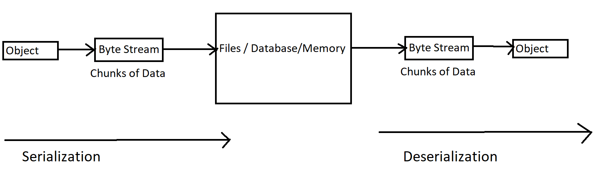
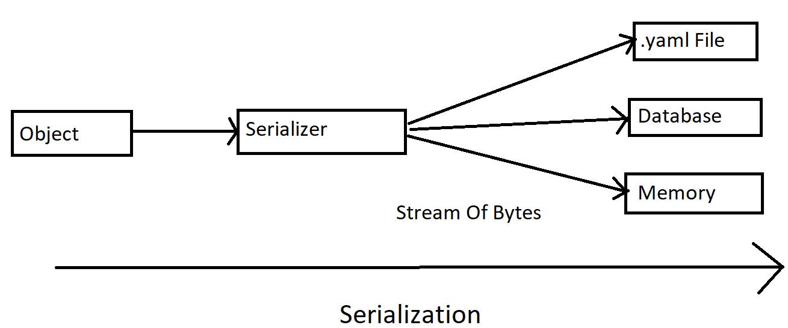

# Yaml Files

Yaml was initially known as "Yet Another Markup Language" which later changed to "Yaml Ain't Markup Language"
The name was changed because Markup languages are used for documents but here in yaml, we can also store object data as well.

- Yaml is a data format used to exchange data.
- It is similar to XML and JSON 
- Used to store configuration data and information in a human readable format
- In yaml, we can store data but not commands

## Extension For Yaml Files

- .yml
- .yaml

## Benefits Of Yaml

- Simple and Easy to read
- Strict Syntax : Indentation is important
- Easily convertable to JSON,XML,etc
- Most languages use yaml
- More Powerful when representing complex data
- We can use various tools such as parsers along with it

## What is a Markup Language?

A Markup language is a computer language which helps us in defining child-parent relationships between different parts of the text documents with the help of symbols or tags inserted into the documents.

Examples Of Markup Languages : HTML, XML, JSON (JavaScript Object Notation), Yaml , etc.

## Data Serialization and Deserialization


**Data Serialization** is a process of converting data objects(a combination of code and data) into a series of bytes which saves the state of this object in a form that is easily transmitted.
If you want to represent this object in a file which you can read and code in, those files are known as Data Serialization files and the language used is Data Serialization Language(A language which could represent this data in text format).
We can also say that Data Serialization is simply storing of data in files.



Suppose, we have a data object (collection of data and code)
Let's assume I want to share the information about this data object in an android app, then a web app ,and then a machine learning model.
The data might be stored in different format in different projects.
There needs to be some sort of a way to share data in a common format which would be accepted everywhere.
To solve this problem, the idea of serialization and deserialization was introduced.

**Serialization** is the process of converting the data objects into a complex data structure or a stream of bytes to transport streams of data through physical devices. These streams of bytes are stored in easily transmittable form which could mean storing object data in a database, a file or computer memory.

It is used to read and transfer data of an object in human readable format

**Deserialization** : Store the data in the format of code and you can then use that file to convert it into an object

Representation of object in the form of code
Yaml is used to store data

## Data Serialization Languages

- yaml
- json
- xml

## Where is Yaml used?

- Configuration files for Docker, Kubernetes, etc
- Logs,Caches,etc.

## Datatypes In Yaml

```yaml
# This is a comment
```

```yaml
# Key Value Pair : Also known as Maps

name: Saarthak
likes: Programming
1: number
```
```yaml
{name: Saarthak, likings: programming}
```

**NOTE** : It is just a textual representation written into a file. We can convert it into a hashmap, json object, etc.

```yaml
# Lists

- hello
- my
- name
- is 
- Saarthak
```

**NOTE:** Yaml is case-sensitive.

```yaml
# Block Style

students:
 - Saarthak
 - John
 - Sarah
```
OR
```yaml
# No need to rely on indentation

students : [Saarthak,John,Sarah]
```

**NOTE:** 
- We can use yaml parsers to check our yaml format
- Indentation via spaces is extremely important

```yaml
# How do we differentiate between documents or configuration for different objects in the same yaml file?

name: Saarthak
# Change in document represented by ---
---
- hello
- nice
- to 
- meet
- you
# Document has finished is represented by ...
...
```

## Working With JSON

```yaml
students:
 - Saarthak
 - John
 - Sarah
```

The above yaml file can be written in a json file in the following way:

```json
{
  "students": [
    "Saarthak",
    "John",
    "Sarah"
  ]
}
```

```yaml
# String Variables

name : Saarthak
fruit : 'apple'
hobby : "chess"
```

**NOTE:** There are 3 ways to represent Strings in yaml

```yaml
# Strings which contain multiple lines while preserving indentation , etc.

description: |
My name is Saarthak and I am learning Yaml.
Thank you for reviewing my devops journey
```

```yaml
# Write a single line in multiple lines

example: >

treated as
a
single line
```
**NOTE:** Yaml can automatically detect what type of datatype it is.

```yaml
# Specifying the Datatype

three : !!int 3
pointFive: !!float 0.5
binary: !!int 0b1101
oct: !!int 0576
hexa: !!int 93 
numberSystem : !!int +934_343_343
infin: !!float .inf
Nan : .nan
bool : !!bool No
string : !!str hello
var : !!null Null
~ : key
exponent : 12E4
```
```yaml
# Adding Dates and Time

date : 2023-05-31
dateAndTime: 2001-12-15T02:59:43.1Z
```

**NOTE:** By default assumes UTC Timezone

```yaml
# Advanced Datatypes

students: !!seq
 - Saarthak
 - John
 - Sarah
```

```yaml
# Sparse Sequence : When some of the keys of the sequence are empty

students: !!seq
 - Saarthak
 - 
 - Sarah
```

```yaml
# Nested Sequences

-
 - nested
 - sequence
-
 - sequence
 - nested
```

```yaml
# Maps

name: !!map Saarthak

# Nested Maps

student:
 name : Saarthak
 likings : chess
```

```yaml
# Pairs : Keys may have duplicate values

pair : !!pairs
 - name: Saarthak
 - name: Jean
```
```yaml
# Sets : Unique Values

fruits : !!set
 ? Mango
 ? Apple
```

```yaml
# Dictionary !!omap
# Entire sequence should be represented as a value

students : !!omap
    - Saarthak:
      likes : apple
    - Mark:
      likes : mango
```

```yaml
# Reusing Properties
# We can overwrite these properties as well

hello: &greetings
 greeting: hola

Saarthak:
 name: Saarthak
 <<: *greetings
```

## Working With XML(Extensible Markup Language)

```yaml
students:
 - Saarthak
 - John
 - Sarah
```

The above yaml file can be written in a xml file in the following way:

```xml
<?xml version="1.0" encoding="UTF-8"?>
<students>Saarthak</students>
<students>John</students>
<students>Sarah</students>
```